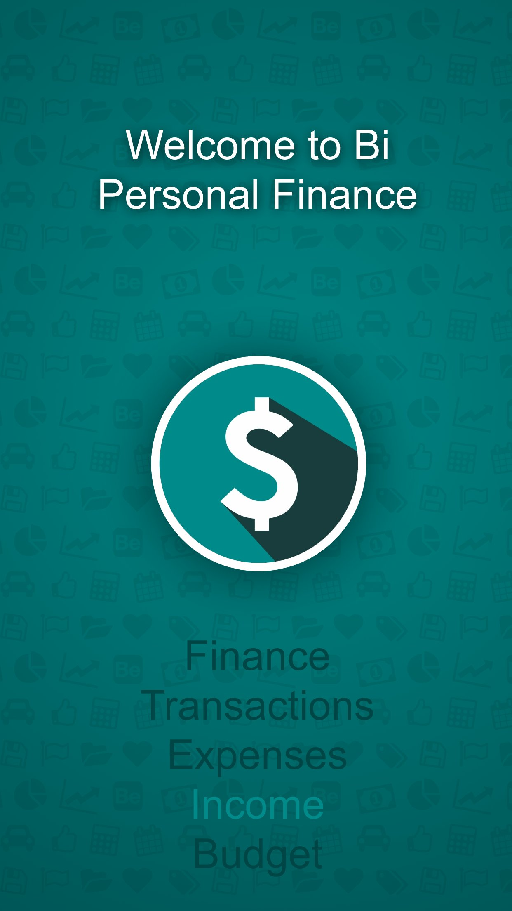
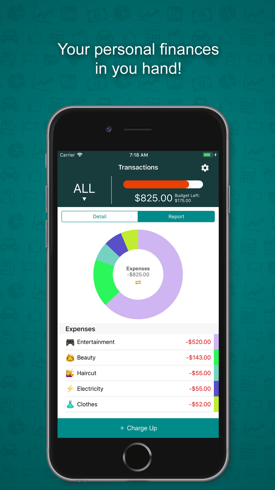
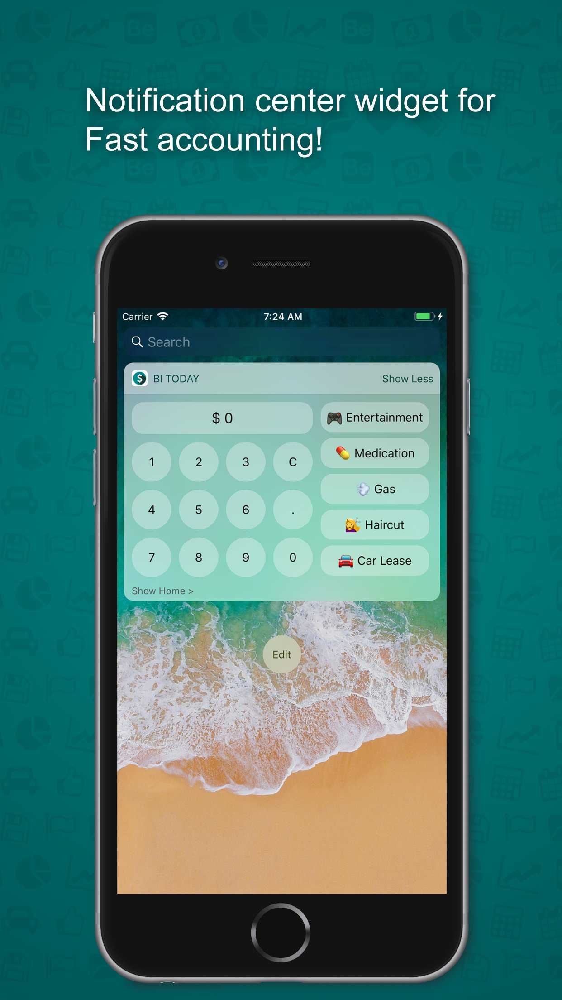
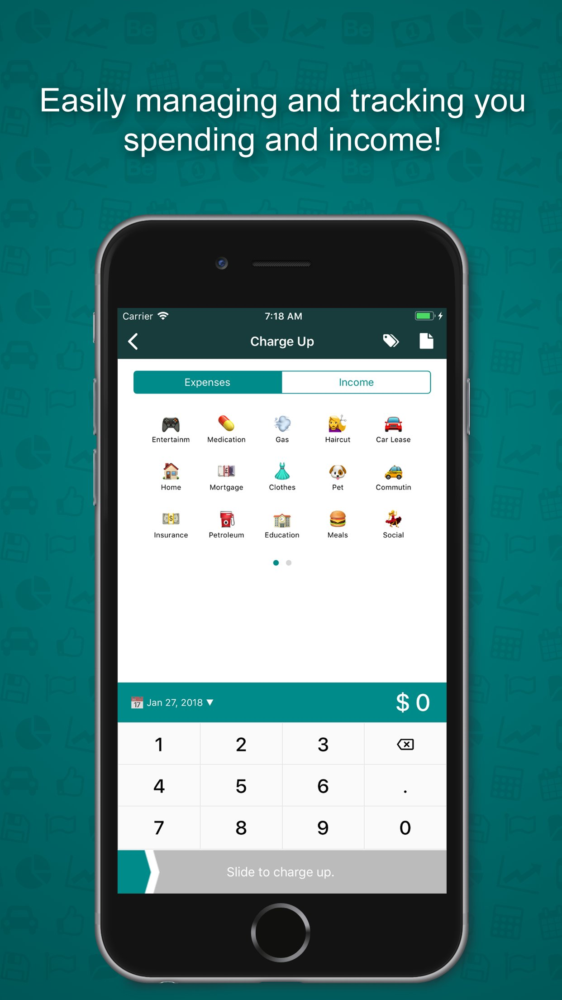
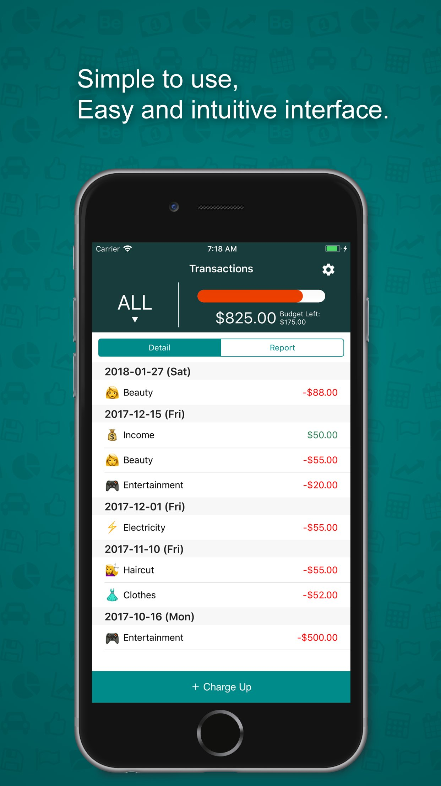

<p align="center">
  
</p>

<h1 align="center">Bi Finance（筆財務）</h1>

<p align="center">
  <b>輕量而功能齊全嘅 iOS 個人記賬應用，支援 Apple Watch 同 Today Widget</b>
</p>

<p align="center">
  
  
  
  
  
  
</p>

<p align="center">
  <a href="README.md">English Version</a>
</p>

---

## 目錄

- [目錄](#目錄)
- [簡介](#簡介)
- [功能特色](#功能特色)
  - [💰 收入同支出追蹤](#-收入同支出追蹤)
  - [🏷️ 分類管理](#️-分類管理)
  - [🔖 標籤系統](#-標籤系統)
  - [📊 視覺化報表同餅圖](#-視覺化報表同餅圖)
  - [📅 靈活日期篩選](#-靈活日期篩選)
  - [💵 每月預算](#-每月預算)
  - [⌚ Apple Watch 應用](#-apple-watch-應用)
  - [📱 Today Widget（通知中心小工具）](#-today-widget通知中心小工具)
  - [⚙️ 設定](#️-設定)
  - [🌐 多語言](#-多語言)
  - [🔒 資料安全](#-資料安全)
- [截圖](#截圖)
- [架構設計](#架構設計)
  - [資料流向](#資料流向)
  - [關鍵架構決策](#關鍵架構決策)
- [專案結構](#專案結構)
- [Core Data 資料模型](#core-data-資料模型)
  - [Accounting（交易記錄）](#accounting交易記錄)
  - [Category（分類）](#category分類)
  - [Tag（標籤）](#tag標籤)
- [Targets 同擴充功能](#targets-同擴充功能)
- [自訂 UI 元件](#自訂-ui-元件)
  - [RMSPieView](#rmspieview)
  - [RMSSlider](#rmsslider)
  - [NumberPad](#numberpad)
  - [TransactionTableViewCell](#transactiontableviewcell)
  - [EmptyInfoTableViewCell](#emptyinfotableviewcell)
- [預設分類](#預設分類)
- [主題同配色](#主題同配色)
- [多語言支援](#多語言支援)
- [系統需求](#系統需求)
- [快速上手](#快速上手)
- [編譯同測試](#編譯同測試)
- [第三方依賴](#第三方依賴)
- [參與貢獻](#參與貢獻)

---

## 簡介

**Bi Finance** 係由 [RM Studio](https://blogrms.wordpress.com) 用 **Objective-C** 開發嘅個人記賬 iOS 應用程式。佢幫用戶追蹤每日收支，提供分類管理、標籤標記、每月預算同埋餅圖視覺化摘要等功能。

專案包含三個 Target：

| Target | 說明 |
|--------|------|
| **Accounting**（iOS 主應用） | 完整嘅交易管理、預算追蹤、圖表分析、設定 |
| **AccountingToday**（Today 小工具） | 通知中心快速記賬——數字鍵盤 + 分類按鈕 |
| **AccountingWatch**（watchOS 應用 + 擴充） | 手錶上揀選分類同輸入金額，即時同步到 iPhone |

所有 Target 透過 **App Groups**（`group.org.rm-s.accounting`）共享同一個 **Core Data** 資料庫。

---

## 功能特色

### 💰 收入同支出追蹤
- 記錄交易金額（最多 10 位整數 + 2 位小數）
- 每筆交易分為「收入」或「支出」
- 可以為每筆交易加備註 / 筆記
- 編輯或刪除已有記錄

### 🏷️ 分類管理
- 內建預設分類連 emoji 圖示（飲食 🍱、教育 🎓、交通 🚌、人工 💰、娛樂 🎮 等）
- 自訂建立新分類——名稱、圖示、類型隨你設
- 拖曳排序分類
- 分類自動經 WatchConnectivity 同步到 Apple Watch

### 🔖 標籤系統
- 建立同管理彩色標籤
- 每筆交易可以加多個標籤，靈活分類
- 設定頁面集中管理標籤

### 📊 視覺化報表同餅圖
- 自訂 `RMSPieView` 動畫餅圖——按分類展示支出分佈
- 可以切換餅圖同交易列表
- 顏色分段對應唔同分類

### 📅 靈活日期篩選
- 自訂日期揀選器，支援 **按月**、**按年** 同 **全部** 三種模式
- 90 年可選範圍（由 2010 年開始）
- 交易列表可以按日期或分類類型分組

### 💵 每月預算
- 設定每月支出上限
- 即時 **進度條** 追蹤實際消費 vs 預算
- 顏色指示：
  - 🟢 綠色：用咗少過 50%
  - 🟡 黃色：用咗 50 – 75%
  - 🟠 橙色：用咗超過 75%

### ⌚ Apple Watch 應用
- 喺手錶上瀏覽已同步嘅分類
- 自訂 **10 鍵數字鍵盤** 輸入金額
- 一撳即建立交易，即時傳送到 iPhone
- 視覺回饋：等待 → 成功 / 失敗狀態

### 📱 Today Widget（通知中心小工具）
- **精簡模式**：撳一下打開主應用
- **展開模式**：完整數字鍵盤 + 頭 5 個分類按鈕，即刻記賬
- 共享 Core Data——喺小工具建立嘅記錄即時出現喺主應用

### ⚙️ 設定
- 管理分類同標籤
- 設定每月預算
- 喺 App Store 評分
- 分享應用俾朋友
- 關於頁面（RM Studio 部落格網頁視圖）

### 🌐 多語言
- 英文同簡體中文介面
- Storyboard 層面同運行時 `.strings` 檔案本地化

### 🔒 資料安全
- 所有資料以 Core Data 儲存喺本機
- 透過 App Group 容器喺各 Target 之間共享
- 用戶資料唔會經網絡傳送（只有「關於」頁面會載入部落格網址）

---


## 截圖

| | | | | |
|---|---|---|---|---|
|  |  |  |  |  |


---

## 架構設計

專案採用經典 **MVC（Model-View-Controller）** 模式：

```
┌───────────────────────────────────────────────────────────┐
│                        App Group                          │
│              group.org.rm-s.accounting                    │
│  ┌─────────────────────────────────────────────────────┐  │
│  │              共享 Core Data 資料庫                   │  │
│  │       （Accounting、Category、Tag 實體）            │  │
│  └────────┬──────────────┬──────────────┬──────────────┘  │
│           │              │              │                  │
│     ┌─────▼─────┐  ┌────▼────┐  ┌──────▼───────┐         │
│     │  iOS 主App│  │ 小工具  │  │  Watch 擴充  │         │
│     │  (MVC)    │  │ (Today) │  │  (WCSession) │         │
│     └───────────┘  └─────────┘  └──────────────┘         │
└───────────────────────────────────────────────────────────┘
```

### 資料流向

```
iPhone ──WCSession──► Apple Watch
  │                       │
  ▼                       ▼
Core Data            sendMessage
  │               （create_item）
  ▼                       │
共享容器 ◄────────────────┘
  │
  ▼
Today Widget
```

### 關鍵架構決策

| 決策 | 原因 |
|------|------|
| **App Groups** | 三個 Target 共用一個 Core Data 資料庫 |
| **WatchConnectivity** | 即時雙向同步（分類 → Watch，交易 → iPhone） |
| **Delegate 模式** | `TransactionDelegate`、`DatePickerDelegate`、`TagDelegate` 封裝複雜嘅 table/picker 邏輯 |
| **Category 擴充** | `CALayer+Addition`、`UIImage+UIImageExtras`、`UIControl+UIButton` 提供可複用嘅 UI 工具 |
| **Plist 驅動預設值** | `DefaultCategory.plist` 提供首次啟動嘅種子資料；`ColorScheme.plist` 控制主題色 |
| **NSDecimalNumber** | 精確貨幣運算——避免浮點數捨入誤差 |

---

## 專案結構

```
rms-accounting/
├── Podfile                              # CocoaPods 依賴清單
├── Accounting/                          # ── iOS 主應用 ──
│   ├── AppDelegate.{h,m}               # 應用生命週期、Core Data 堆疊、WCSession
│   ├── main.m                          # 程式入口
│   ├── Info.plist                      # Bundle 設定（顯示名稱：Bi）
│   ├── Accounting.entitlements         # App Group 權限
│   ├── Config Files/
│   │   ├── DefaultCategory.plist       # 首次啟動預設分類
│   │   └── ColorScheme.plist           # 主題配色
│   ├── Controllers/
│   │   ├── ViewController              # 主畫面：摘要、餅圖、交易列表
│   │   ├── KeepAccountsViewController  # 新增 / 編輯交易
│   │   ├── CategoryViewController      # 分類管理
│   │   ├── TagSettingViewController    # 標籤管理
│   │   ├── TagViewController           # 標籤揀選
│   │   ├── NoteViewController          # 交易備註編輯器
│   │   ├── SettingViewController       # 應用設定
│   │   └── AboutUsViewController       # 關於頁面（網頁視圖）
│   ├── Models/
│   │   ├── BaseModel                   # 共享 Core Data 工具
│   │   ├── AccountingModel             # 交易 CRUD 同查詢
│   │   ├── CategoryModel               # 分類 CRUD 同類型篩選
│   │   └── TagModel                    # 標籤 CRUD
│   ├── Entities/                       # Core Data 自動生成類別
│   ├── Delegate/
│   │   ├── TransactionDelegate         # 交易列表資料源
│   │   ├── DatePickerDelegate          # 自訂日期揀選器邏輯
│   │   └── TagDelegate                 # 標籤列表資料源
│   ├── Views/
│   │   ├── RMSPieView                  # 動畫餅圖
│   │   ├── RMSSlider                   # 拖曳確認滑桿
│   │   ├── TransactionTableViewCell    # 交易列 Cell
│   │   └── EmptyInfoTableViewCell      # 空狀態佔位 Cell
│   ├── Services/
│   │   ├── BudgetManager               # 每月預算讀寫
│   │   ├── NumberPad                   # 數字輸入處理器
│   │   └── Utils                       # 裝置偵測、日期運算、工具方法
│   ├── Supporting Files/               # FontAwesome 字型 + UIKit 擴充
│   ├── en.lproj/                       # 英文本地化
│   └── zh-Hans.lproj/                  # 簡體中文本地化
│
├── AccountingToday/                     # ── Today 小工具 ──
│   └── TodayViewController             # 精簡 + 展開模式數字鍵盤
│
├── AccountingWatch/                     # ── watchOS 應用 ──
│   └── Base.lproj/                     # Watch Storyboard
│
├── AccountingWatch Extension/           # ── watchOS 擴充 ──
│   ├── InterfaceController             # 分類列表、WCSession 同步
│   ├── NumberPadController             # Watch 數字鍵盤
│   ├── CategoryRow                     # Watch 表格列
│   ├── ExtensionDelegate               # Watch 應用生命週期
│   └── NotificationController          # 推送通知處理
│
├── AccountingTests/                     # 單元測試
└── AccountingUITests/                   # UI 測試
```

---

## Core Data 資料模型

三個實體儲存喺共享嘅 `NSPersistentContainer`：

### Accounting（交易記錄）

| 屬性 | 類型 | 說明 |
|------|------|------|
| `id` | String | 唯一識別碼 (UUID) |
| `amount` | Decimal | 交易金額 |
| `category` | String | 分類名稱 |
| `comment` | String | 用戶備註 |
| `tags` | String | 逗號分隔嘅標籤名 |
| `create_time` | Date | 交易日期 |
| `currency` | String | 貨幣代碼 |
| `user_id` | String | 用戶參考 |
| `last_sync_time` | Date | 最後同步時間 |

### Category（分類）

| 屬性 | 類型 | 說明 |
|------|------|------|
| `name` | String | 顯示名稱 |
| `icon` | String | Emoji 圖示 |
| `alias` | String | 別名 |
| `type` | String | `"Income"` 或 `"Expenses"` |
| `sequence` | Int16 | 排序順序 |

### Tag（標籤）

| 屬性 | 類型 | 說明 |
|------|------|------|
| `name` | String | 標籤名稱 |
| `color` | Int32 | 顏色值 |
| `sequence` | Int16 | 排序順序 |

---

## Targets 同擴充功能

| Target | 平台 | 用途 | 資料共享 |
|--------|------|------|----------|
| **Accounting** | iOS 10+ | 主應用 | Core Data（App Group） |
| **AccountingToday** | iOS 10+ | Today 小工具——快速記賬 | Core Data（App Group） |
| **AccountingWatch** | watchOS | Watch 介面 Storyboard | — |
| **AccountingWatch Extension** | watchOS | Watch 邏輯 + WCSession | WatchConnectivity 訊息 |

---

## 自訂 UI 元件

### RMSPieView
用 `UIBezierPath` 同 `CAShapeLayer` 繪製嘅動畫餅圖。接受一組數值，按比例渲染唔同顏色嘅扇形區域，帶平滑動畫效果。

### RMSSlider
拖曳確認滑桿控件（類似「滑動解鎖」）。用戶需要拖動把手嚟確認交易——防止誤觸提交。

### NumberPad
主應用、Today 小工具同 Watch 擴充共用嘅數字輸入引擎。規則：
- 最多 10 位整數
- 最多 2 位小數
- 正確處理小數點
- 支援退格刪除

### TransactionTableViewCell
顯示單筆交易嘅列——分類 emoji、分類名、金額（綠色 = 收入，紅色 = 支出）同日期。

### EmptyInfoTableViewCell
冇交易時顯示嘅佔位 Cell，用 FontAwesome 圖示配描述文字。

---

## 預設分類

首次啟動時由 `DefaultCategory.plist` 載入：

| 圖示 | 名稱 | 類型 |
|------|------|------|
| 🍱 | Food（飲食） | 支出 |
| 🎓 | Education（教育） | 支出 |
| 🚌 | Commute（交通） | 支出 |
| 💰 | Wages（人工） | 收入 |
| 🎮 | Entertainment（娛樂） | 支出 |
| 🍸 | Social（社交） | 支出 |
| ⚽️ | Sport（運動） | 支出 |
| ✈️ | Travel（旅遊） | 支出 |
| 🎁 | Gift（禮物） | 支出 |

用戶可以隨時喺設定入面新增、編輯、排序同刪除分類。

---

## 主題同配色

由 `ColorScheme.plist` 同運行時常數設定：

| 元素 | 顏色 | Hex / RGB |
|------|------|-----------|
| 主色 / 導航列 | 深藏青 | `#2B314D` |
| 強調色 / 選中狀態 | 深青色 | `#008B8B` |
| 收入金額 | 綠色 | `rgb(0, 201, 87)` |
| 支出金額 | 紅色 | `rgb(255, 0, 0)` |
| 預算 < 50% | 綠色 | 系統預設 |
| 預算 50 – 75% | 黃色 | 系統預設 |
| 預算 > 75% | 橙色 | 系統預設 |

圖示以 **FontAwesome 4.7**（內置 `fontawesome-webfont.ttf`）渲染。

---

## 多語言支援

| 語言 | 資料夾 | 範圍 |
|------|--------|------|
| 英文 | `en.lproj/` | 介面 + 字串 |
| 簡體中文 | `zh-Hans.lproj/` | 介面 + 字串 |

Storyboard 字串喺 `Main.strings`；運行時字串喺 `Localizable.strings`。歡迎貢獻更多語言。

---

## 系統需求

| 需求 | 版本 |
|------|------|
| macOS | 10.13+ |
| Xcode | 10+（建議 12+） |
| iOS Deployment Target | 10.0 |
| CocoaPods | 1.x |
| 開發語言 | Objective-C |

---

## 快速上手

```bash
# 1. 克隆專案
git clone https://github.com/<your-username>/rms-accounting.git
cd rms-accounting

# 2. 安裝 CocoaPods 依賴
pod install

# 3. 開啟 workspace（唔好開 .xcodeproj）
open Accounting.xcworkspace
```

揀選 **Accounting** scheme，喺模擬器或真機上運行。

> **注意**：如要運行 Watch 應用，請揀選 **AccountingWatch** scheme 並配對 Watch 模擬器。

---

## 編譯同測試

```bash
# 編譯（模擬器）
xcodebuild -workspace Accounting.xcworkspace \
  -scheme Accounting \
  -configuration Debug \
  -sdk iphonesimulator \
  build

# 執行單元測試
xcodebuild test \
  -workspace Accounting.xcworkspace \
  -scheme Accounting \
  -destination 'platform=iOS Simulator,name=iPhone 14'

# 執行 UI 測試
xcodebuild test \
  -workspace Accounting.xcworkspace \
  -scheme AccountingUITests \
  -destination 'platform=iOS Simulator,name=iPhone 14'
```

---

## 第三方依賴

透過 **CocoaPods**（`Podfile`）管理：

| Pod | 版本 | 用途 |
|-----|------|------|
| [Charts](https://github.com/danielgindi/Charts) | ~> 3.0.5 | 圖表庫（餅圖資料來源） |

---

## 參與貢獻

歡迎貢獻、提交問題同功能請求！

1. **Fork** 本倉庫
2. 建立功能分支：`git checkout -b feature/amazing-feature`
3. 提交你嘅修改：`git commit -m 'Add amazing feature'`
4. 推送到分支：`git push origin feature/amazing-feature`
5. 開一個 **Pull Request**

請遵循現有嘅 Objective-C 編碼風格，並撰寫清晰嘅 commit 訊息。